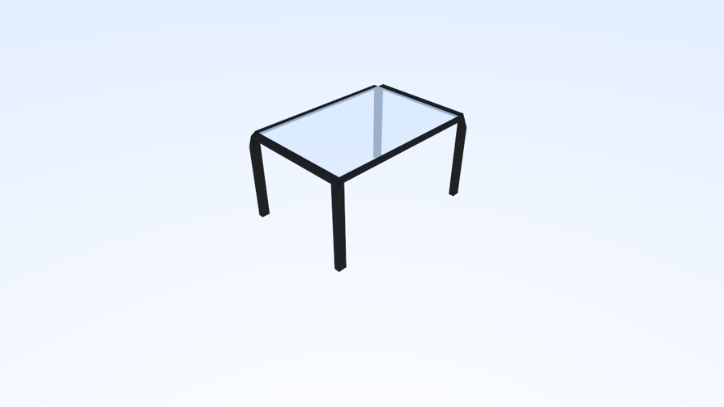
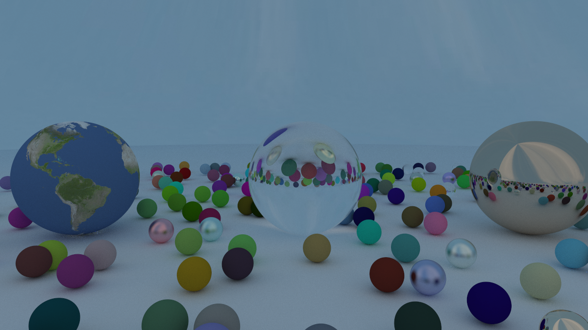
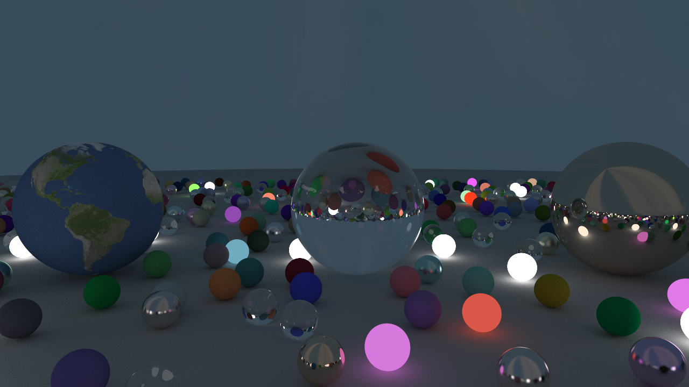
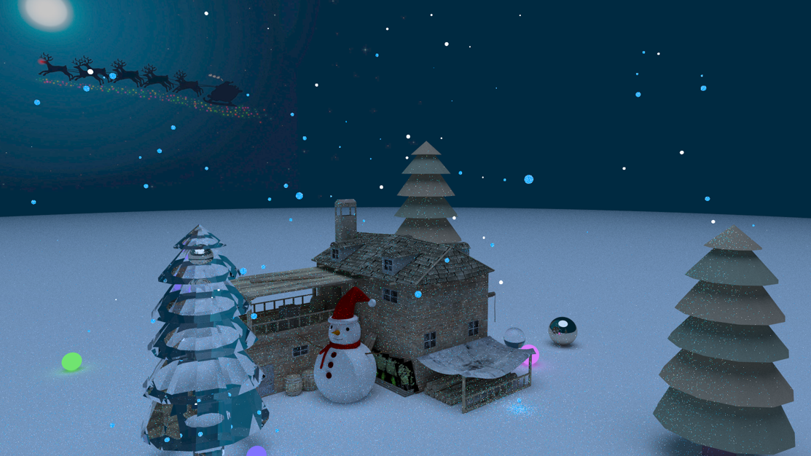
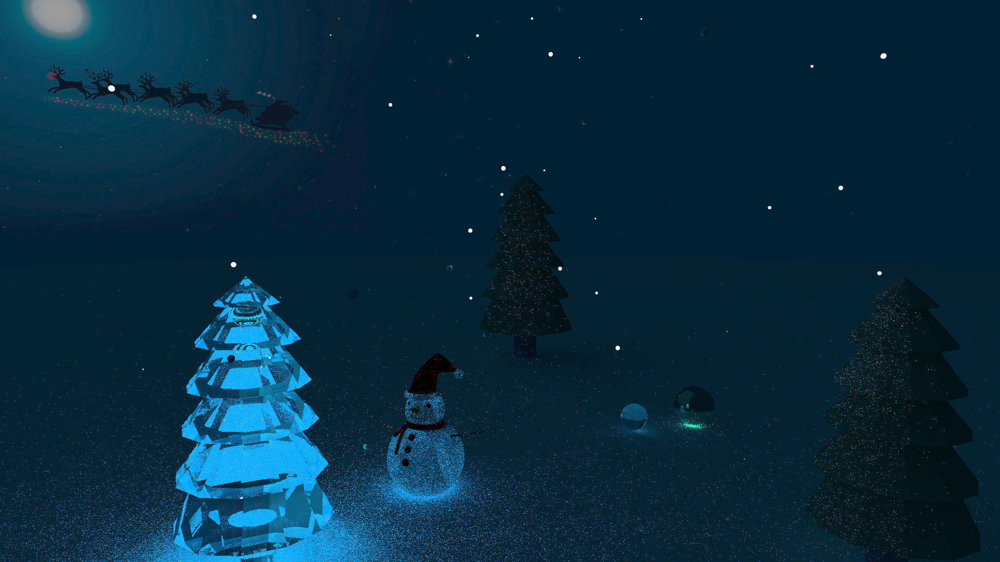
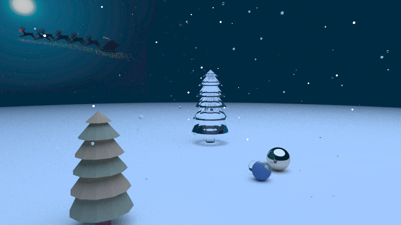

# 第六组 光线追踪渲染器的完善

[toc]

## 1 项目概述

我们在Assignment 5的基础上完成了如下功能，首先是基本功能。

+ **加载网格模型和三角形的渲染。**我们使用assimp库提供的API来读取网格模型，并基于现有的编程模型将模型映射到三角形集合上。对于材质部份，我们分析了根据现有的材质的实现和 assimp 提供的光照模型之间的对应关系，从而成功读取了材质信息。在齐次坐标下，我们将所有的形变统一归结到矩阵变换中，然后使用glm库对网格模型上的各个点利用矩阵向量乘法进行变换，就可以实现网格模型的形变。
+ **添加纹理。**对于有纹理的材质，我们基于assimp在顶点上提供的UV 坐标，插值计算出面上各点的 UV 坐标，最后再对应到纹理上。此外，我们根据assimp实现了纹理栈上定义的计算，逐层地叠加纹理图片文件。
+ **添加光源。**我们认为，光源其实就是一种特殊的材质。因此在光线追踪渲染的过程中，当射线射向光源时，光源不会产生新的光线，而是直接返回一个光源颜色。
+ **构建BVH树。**我们首先给出了使用两个点来定义AABB的方法，然后给出光线和AABB相交的判断依据，最后我们使用二分和递归划分的方法来构建整个场景的BVH树。通过比较引入BVH前后的差异，我们发现BVH能够显著减少场景渲染的求交次数，从而实现加速。
+ **多线程加速。**由于场景中的每个像素的渲染是独立的，因此我们使用了openMP库来对场景的每个像素的渲染进行多线程并行加速。相比较于不使用单线程的情况，多线程可以显著提高渲染速度。

然后是可选功能。

+ **添加天空盒背景。**我们在已经实现了纹理贴图和三角网格的前提下，使用球体的的三角网格模型加上天空的纹理就可以实现天空包围盒。

+ **实现蒙特卡洛积分。**我们使用蒙特卡洛方法对光线的采样积分，并通过俄罗斯轮盘赌算法避免了无限递归，最后我们实现了复合重要性采样。

  

## 2 在课堂展示后实现的新内容

在上次课堂展示后，我们在后续阶段实现了如下内容：

- 实现了蒙特卡洛积分的**复合重要性采样**与**RR式递归**；

- **颜色溢出处理**由局部处理修改为全局处理；

- 对代码进行了优化；

  

## 3 构建BVH树

BVH树的构建分为三个部分，如下所示。

+ 定义物体的AABB(轴对齐包围盒)。
+ 定义光线与AABB相交的判断依据。
+ 构建BVH树。

### 3.1 定义AABB

对于一个AABB而言，其由8个顶点构成。但是，由于AABB是轴对齐的，我们只需要2个点$near,far$即可确定AABB的位置。给定一个物体$O$，设其由点集$P=\{p_1,p_2,\cdots,p_n\}$唯一确定，每一个点$p_i$都是三维空间中的点。此时，$A,B$的坐标可以由如下公式给出。
$$
near=(\min_{i}\ p_i.x,\ \min_{i}\ p_i.y,\ \min_{i}\ p_i.z)\\

far=(\max_{i}\ p_i.x,\ \max_{i}\ p_i.y,\ \max_{i}\ p_i.z)\\
$$

### 3.2 光线相交的判断依据

对于一个包围盒$AABB$，和光线$R=p_0+t\cdot\vec{d}$。若光线$R$与包围盒$AABB$相交，则显然只有两个交点$p_1,p_2$。对于$X$分量，我们可以求得光线$R$和包围盒$AABB$的两个平行于$YOZ$平面的两个平面相交时的$t$值。首先，令

$$
near.x=p_0.x+t\cdot(\vec{d}.x)\\

far.x=p_0.x+s\cdot(\vec{d}.x)
$$

此时可以得到两个解$t,s$，令

$$
t_x^1=\min(t,s)\\

t_x^2=\max(t,s)\\
$$

我们可以得到区间$[t^1_x,t^2_x]$，同理，我们可以得到区间$[t^1_y,t^2_y]$和区间$[t^1_z,t^2_z]$。此时，当光线$R$和包围盒$AABB$时，我们有

$$
[t_x^1,t_x^2]\ \and[t_y^1,t_y^2]\ \and[t_z^1,t_z^2]\ne\empty 
$$

### 3.3 BVH树的构建

和前面的方法类似，一个场景的包围体$bouding\ volume$实际上也是一个$AABB$。也就是说，$bouding\ volume$也只需要通过两个顶点即可确定。在构建$BVH$树时，我们采用了递归的思想。首先对于一个场景，若其物体数为$1$，则$bounding\ volume$记为该物体的$AABB$。否则，我们随机地将场景中的物体划分为均等两部分，首先求出这两个部分的$bounding\ volume$，记为$BV_{left},BV_{right}$，则场景的$bouding\ volume$的两个顶点$near$和$far$由下面的公式给出。

$$
near.x=\min(BV_{left}.near.x,\ BV_{right}.near.x)\\

near.y=\min(BV_{left}.near.y,\ BV_{right}.near.y)\\

near.z=\min(BV_{left}.near.z,\ BV_{right}.near.z)\\


far.x=\max(BV_{left}.far.x,\ BV_{right}.far.x)\\

far.y=\max(BV_{left}.far.y,\ BV_{right}.far.y)\\

far.z=\max(BV_{left}.far.z,\ BV_{right}.far.z)\\
$$

如此我们便构建出BVH树。当给定一个场景和场景的$BVH$树后，判断场景和光线是否可能存在交点便可以细化为判断场景的BVH树的两个BVH树表示的两个子场景是否和光线存在交点。


## 4 加载网格模型

加载网格模型的工作可以分为三部分，如下所示。

1. 将网格从文件中读取进来，并且将其映射到三角形上。
2. 读取网格模型上的材质信息，并且和现有的材质系统对应起来。
3. 对网格模型进行几何变换。

我们下面逐一来看三者的实现。

### 4.1 读取网格

我们选取assimp库来读取网格模型，这使得我们能够兼容多种文件格式。实际上，网格模型是三角形的集合。为了能够在现有的编程逻辑上表示网格模型，我们将三角形定义为继承hittable的类，从而使得我们可以自然的使用继承自hittable_list的类mesh来表示网格模型。

assimp 读取的网格信息是按照层次结构来定义的。整个场景被定义为aiScene，然后包含一个根节点网格，每个网格又可能包含多个子网格。此外，assimp提供了对网格信息的预置变换函数，我们可以令assimp将网格的面自动转换为三角形，并且为没有法向量的面生成法向量。

由此，我们可以编写加载场景的函数 model::load_model和递归加载网格的函数 model::process_mesh。

### 4.2 读取材质信息

assimp 中，每个网格都关联了一个材质号 mesh->mMaterialIndex。这个材质号可以对应到场景的全局材质 scene->mMaterials 内对应下标的元素。

assimp的材质系统是基于传统的光栅话渲染、RGBA 四通道颜色模型的，这和我们基于物理的光线追踪模型有所不同。assimp 为材质提供了环境、漫反射、镜面反射、发射（光源）和透明五种颜色，并且提供了透明度和折射率的参数。我们根据 assimp 提供的光照模型（随材质不同而有差异）将其与物体的漫反射、镜面反射与折射光相对应起来。

对于有纹理的材质，assimp 在顶点上提供了 UV 坐标，而我们可以基于插值计算出面上各点的 UV 坐标从而对应到纹理上。此外，assimp 实现了纹理栈，因此我们要根据栈上定义的计算，逐层地叠加纹理图片文件。

### 4.3 实现形变

基于齐次坐标系统，我们可以将形变定义为一个矩阵 A。我们对网格模型上的各个点利用矩阵向量乘法进行变换，就可以实现网格模型的形变。

我们引入了glm库来实现矩阵定义和矩阵向量乘法，并基于此封装了变换类 transform 和 matrix_transform。此外，glm中可以快速地帮助我们计算变换矩阵，因此我们可以利用glm来直接得到我们所需的矩阵，而不需要手动运算。


## 5 多线程加速与加速效果

我们使用了openMP库来对场景的每个像素的渲染进行多线程并行加速。相比较于不使用单线程的情况，多线程可以显著提高渲染速度。

我们测试使用的CPU是Core i5-10210U 1.60GHz，对每组数据，我们分别测试3次然后取平均值，结果如下。

|            | width=50 | width=100  |
| ---------- | -------- | ---------- |
| BVH+openMP | 987.219s | 4365.62s   |
| BVH        | 1117.75s | 4416.22s   |
| openMP     | 7958.38s | 35193.065s |
| 无加速     | 12360.7s | 46375.6s   |

我们可以看到，相比于无加速的情况，使用了BVH后可实现加速11.0倍；使用多线程后，可以加速1.5倍。由此看来，BVH的加速效果较为明显，说明渲染的时间大部分耗费在了无意义的求交次数上面。二者结合后可以实现加速12.5倍。


## 6 光源的实现

光源的实现分为两部分，如下所示。

+ 光源材质的构建。
+ 相关着色函数的修改。

### 6.1 实现光源材质

换一种角度进行思考的话，光源其实就是一种特殊的材质。在光线追踪渲染的过程中，当射线射向光源时，光源不会产生新的光线，而是直接返回一个光源颜色。通过这种思路，我们就可以实现一种光源材质，当任意物体与该材质绑定时，该物体就变成一个光源。

在原始材质类中，我们通过scatter()函数判断获取新射线、更新相关数值。因此，在光源材质light_source中，我们设置scatter()函数不会产生新射线，并返回false以表示光追递归到此结束。此外，，我们设置了emit()函数用以返回光源颜色。对于非光源材质，该函数返回0。

### 6.2 距离衰减与颜色溢出处理

为了适配光源材质，我们需要对实现渲染的递归函数ray_color()进行修改。一旦无法获取新射线，函数就会通过材质的emit()获取颜色并返回。因为只有光源才会有颜色，而其他材质的emit()只会返回0，因此从实现效果上看，就相当于只有光源发光。

光在传播时是存在能量衰减的，随着距离的增加颜色会越来越暗。因此，在获取光源颜色后，我们需要根据击中光源的射线传播距离去修正颜色。公式如下所示：

$$
new\_color=\frac{old\_color}{distance^2}
$$
在设置光源时，我们可以设置其RGB值均大于1，以体现出其比其他物体“更亮”的效果，但在将最终的RGB值存进图片时，可能会因为数值溢出导致像素显示不正常。由数字图像处理的知识可知，对RGB三个分量按同一比例放缩时，色调不会发生变化，只有亮度受到影响。因此，在将RGB值写入对应像素时，如果出现分量值大于1的情况，我们会将RGB值进行放缩，以便正常显示。
$$
\begin{align}

mc&=\max\{R,G,B\}\\

[R',G',B']&=[\frac{R}{mc},\frac{G}{mc},\frac{B}{mc}] & {\rm if}\ mc>1
\end{align}
$$


## 7 天空包围盒

在已经实现了纹理贴图和三角网格的前提下，只需要用立方体的三角网格模型加上天空的纹理就可以实现天空包围盒。但是这样带来的问题是容易看出包围盒的边界的不自然的光照效果，而将三角网格放大会导致插值的效果不好，因此我们将包围盒改为球体，将法向量设为向内。这样实现的天空包围盒的效果最佳。


## 8 蒙特卡洛积分

蒙特卡洛积分方法是数值分析的一个重要分支，其核心是使用随机性来解决确定性的问题。对于满足某个概率分布的随机变量，其数学期望所描述的积分可以使用这个随机变量随机抽样的样本均值来近似，因此在一定的误差范围内，我们能够使用大量的随机数来近似积分运算的结果。在计算机图形学中，我们可以使用蒙特卡洛方法来模拟光照传输中的积分运算，从而获得更好的光线追踪效果。在本次项目中，我们分别实现了蒙特卡洛积分在光线追踪的三个应用，分别是俄罗斯轮盘赌式递归、随机性采样和复合重要性采样。

### 8.1 俄罗斯轮盘赌式递归

在现实生活中，光线弹射的次数是无穷的，显然计算机无法模拟这种“无穷”的过程。在个人作业中，我们实现的光线追踪算法通过限制递归深度来避免无限弹射。然而，简单地限制递归深度会导致光线后续的能量损失，从而得到不正确的渲染结果。因此，我们需要一种新的递归结束条件，那就是俄罗斯轮盘赌（Russian Roulette），简称RR。

RR的主要思想是以一定的概率去停止递归，并且保证期望值是正确的渲染结果。我们人为设定一个概率$P(0<P<1)$，当递归函数的光路击中非光源物体时，在$0\sim 1$中获取随机数$q$。若$q<P$，那么就继续递归，获取新光路得到$L_0$，最终返回$\frac{L_0}{P}$；反之，则直接返回0。通过将结果描述为01分布，那么期望值即为：
$$
E=P\times\frac{L_0}{P}+(1-P)\times0=L_0
$$

实现代码如下所示：

```c++
color PathTracer::ray_color(const ray &r, const hittable &world, shared_ptr<hittable> lights)
{
	// 轮盘赌
	double choice = random_double();
	if (choice > CONTINUE_PROBABILITY)
		return color(0, 0, 0);
    else
    {
        color return_color;
        /* ...... */
        return return_color/CONTINUE_PROBABILITY;
    }
}
```

### 8.2 随机性采样

蒙特卡洛积分最基础的实现是随机性采样。随机性采样不考虑物体及光源在场景中的位置，而仅仅是在半球上根据半球概率进行随机采样。将随机性采样和RR结合在一起，假设当前光路$r$的起始位置为$a$，发射新光线的概率为$P_r$，获取颜色的递归函数为$ray\_color(a,r)$，那么将随机性采样和RR结合在一起的算法流程如下所示：

1. 获取随机数$q\in[0,1]$，若$q<P_r$，则继续执行，否则返回0；

2. 获取新的光路$r_{new}$，其概率密度函数值为$p(r_{new})$；

3. 若新光路击中点$b$为光源，则返回$\frac{I}{p(r_{new})P_r}$；若$b$不是光源，则返回$\frac{ray\_color(a,r_{new})}{p(r_{new})P_r}$；

   以上是$ray\_color(a,r)$的递归过程。对每个像素重复射出$N$条射线，然后取平均值，即可得到像素的颜色。

### 8.3 复合重要性采样

随机性采样存在一个不可忽略的缺陷，那就是由于新光路是随机获取的，计算机不能如同现实一般获取无穷多条新光路。这就导致了如果光源数量较少或距离较远，我们就很可能无法采样到贡献较大的光源。为了获得更精确的估算，我们一般使用重要性采样。

重要性采样（importance sampling）是蒙特卡罗方法中最重要的方差缩减方法，它通过选择对一个与目标概率分布具有相似形状的分布函数进行抽样来减少方差。换言之，其试图在被积函数中贡献较多的区域放置更多的采样点，以体现这部分区域的重要性。对于概率密度函数$p(x)$，我们需要根据被积函数$f(x)$的值来调整它的概率分布，若$f(x)$的值较大，就在这个地方多采样几个点，否则就少采样几个点。

不过在实际场景中，被积函数十分复杂，往往不能直接找到一个与被积函数相似的简单分布，因此我们通常使用复合重要性采样。通常一个复杂的被积函数是多个不相关的简单分布的乘积形式，因此我们可以分别从这些分布中进行采样，对每个分布都进行一次估算，最后对采样结果进行加权求和，权值由平衡启发式确定。

在本次项目中，我们参考《Ray Tracing: The Rest of Your Life》，在其基础上实现了RR式递归的复合重要性采样，采样的分布为Lambertian材质的BRDF采样分布和光源采样分布。

#### 8.3.1 Lambertian材质的BRDF采样分布

对于Lambertian材质的BRDF采样分布，假设$\theta$是光线与表面法向量的夹角，那么我们假设Lambertian材质的光线散射分布与$\cos\theta$成正比，当夹角接近于0时光线散射较多，而当$\theta\geq 90^\circ$时不会发生光线散射。不妨设光线散射概率密度函数为$p(\theta)=C\cos\theta$，其中$C$为常数，由$p(\theta)$在整个半球上的积分为1解得$C=\frac{1}{\pi}$。因此，Lambertian材质的光线散射概率密度函数PDF为：
$$
p(direction)=\frac{\cos\theta}{\pi}
$$
根据该PDF，我们就可以通过随机抽样生成服从该分布的随机半球向量。对PDF进行半球上的积分，在球面坐标系中我们可以得到概率分布函数：
$$
\begin{align*}
P(\theta)&=\int_{\Omega}\frac{\cos\theta}{\pi}d\omega\\
&=\int^{2\pi}_0d\phi\int^\theta_0\frac{\cos t}{\pi}\sin t dt\\
&=1-\cos^2\theta
\end{align*}
$$
取均匀随机数$r_1\in[0,1]$作为$P(\theta)$值，我们就可以通过随机抽样得到随机方向向量的$\theta$值：
$$
\theta=\arccos\sqrt{1-r_1}
$$
在球面坐标系上，一个向量的方向由$\theta$和$\phi$组成。对于Lamberatian材质，光线在方向角上是均匀分布的，故$\phi$的概率密度函数为$\frac{1}{2\pi}$，概率分布函数为$\frac{\phi}{2\pi}$。取均匀随机数$r_2\in[0,1]$，即可通过随机抽样得到随机方向的$\phi$值：
$$
\phi=2\pi r_2
$$
将$(\theta,\phi)$转换为笛卡尔坐标系的坐标形式$(x,y,z)$，即为Lambertian材质的采样方向随机向量。由于该坐标系是以击中物体表面的法线作为z轴方向，切线作为x、y轴方向，因此我们还需要构建局部坐标系，并且实现全局坐标系与局部坐标系之间的相互转换。

具体到实现上，我们创建了PDF类，其中$value(direction)$用于获取$direction$的PDF函数值，而$generate()$用于获取新的采样方向。然后我们继承PDF类创建cosine_pdf类，代码如下所示：

```c++
class pdf {
    public:
        virtual ~pdf(){}
        virtual double value(const vec3& direction) const=0;
        virtual vec3 generate() const=0;
};
inline vec3 random_cosine_direction(){
    double temp1=random_double();
    double temp2=random_double();
    double z = sqrt(1-temp2);
    double phi = 2*pi*temp1;
    double x = cos(phi)*sqrt(temp2);
    double y = sin(phi)*sqrt(temp2);
    return vec3(x,y,z);
}
class cosine_pdf:public pdf {
    public:
        cosine_pdf(const vec3& w) {
           uvw.build_from_w(w); 
        }
        virtual double value(const vec3& direction) const override {
            double cosine=dot(unit_vector(direction), uvw.w());
            return (cosine<=0)?0:cosine/pi;
        }
        virtual vec3 generate() const override {
            return uvw.local(random_cosine_direction());
        }
    public:
        onb uvw;// 局部坐标正交基
};
```

#### 8.3.2 光源采样分布

由于光源对物体表面的颜色贡献较大，因此直接对光源采样可以得到更准确的估算结果。在我们的项目中，光源有两种类型，分别是三角面片光源和球形光源。在直接对光源采样时，我们需要得到光源投影到半球上的区域，然后对光源区域进行均匀采样。


对于三角面片光源，假设其三角面片面积为$A$，采样方向向量与三角面片表面的法线向量夹角为$\alpha$，采样距离为$r$，那么有概率密度函数：
$$
p(prediction)=\frac{r^2}{A\cos\alpha}
$$
实现代码如下所示，其中$pdf\_value()$用于获取相应方向的PDF函数值，$random()$用于获取新的采样方向：

```c++
class triangle : public hittable
{
private:
    vertex v0, v1, v2;
    shared_ptr<material> mat_ptr;
    vec3 face_normal;
    vec3 v0v1, v0v2;
public:
    /* ...... */
    double pdf_value(const point3& origin, const vec3& direction) const
    {
        hit_record rec;
        if (!this->hit(ray(origin, direction), 0.001, infinity, rec))
        return 0;

        vec3 temp = cross(v0v1, v0v2);
        double area = temp.length()/2; // 三角形面积
        double distance_squared = rec.t*rec.t*direction.length_squared();
        double cosine = fabs(dot(direction, rec.normal)/direction.length());
        return distance_squared/(cosine*area);
    }

    vec3 random(const point3& origin) const
    {
        double length1 = random_double();
        double length2 = random_double();
        point3 random_point = v0+v0v1*length1+v0v2*length2;
        return random_point-origin;
    }
};

```

对于球形光源，假设从物体表面上的一点望向一个球形光源，然后可以建立一个球面坐标系$(\theta,\phi)$，其中$\theta$是采样方向向量与物体表面的点与球心构成的的方向向量的夹角。


由上图可知，$\phi\in [0,2\pi]$，而$\theta\in[0,\theta_\max]$，其中$\theta_\max=\arcsin\frac{R}{\Vert \textbf{C}-\textbf{P}\Vert^2}$。与Lambertian材质的BRDF采样分布类似，对于$\phi$，取均匀随机数$r_1\in[0,1]$，可以通过随机抽样得到$\phi=2\pi r_1$；对于$\theta$，由于是均匀采样，故概率密度函数为常数，设为$C$，那么其概率分布函数为：
$$
\begin{align*}
P(\theta)&=\int_{\Omega}Cd\omega=\int^{2\pi}_0d\phi\int^\theta_0C\sin t dt=2\pi C(1-\cos\theta)
\end{align*}
$$
由$P(\theta_\max)=1$解得$C=\frac{1}{2\pi(1-\cos\theta_\max)}$，故取随机均匀随机数$r_2\in[0,1]$，可以通过随机抽样得到$\cos\theta=1+r_2(\sqrt{1-\frac{R^2}{\Vert \textbf{C}-\textbf{P}\Vert^2}}-1)$。综上所述，实现代码如下所示：

```c++
inline vec3 random_to_sphere(double radius, double distance_squared) 
{
    auto r1 = random_double();
    auto r2 = random_double();
    auto z = 1 + r2*(sqrt(1-radius*radius/distance_squared) - 1);
    auto phi = 2*pi*r1;
    auto x = cos(phi)*sqrt(1-z*z);
    auto y = sin(phi)*sqrt(1-z*z);
    return vec3(x, y, z);
}
double sphere::pdf_value(const point3& origin, const vec3& direction) const 
{
    hit_record rec;
    if (!this->hit(ray(origin, direction), 0.001, infinity, rec))
    return 0;
    auto cos_theta_max = sqrt(1 - radius*radius/(center-origin).length_squared());
    auto solid_angle = 2*pi*(1-cos_theta_max);
    return  1 / solid_angle;
}
vec3 sphere::random(const point3& origin) const 
{
    vec3 direction = center - origin;
    auto distance_squared = direction.length_squared();
    onb uvw;
    uvw.build_from_w(direction);
    return uvw.local(random_to_sphere(radius, distance_squared));
}
```

#### 8.3.3 复合重要性采样

由于场景可能有多个光源，故在直接光源采样时采用均匀随机策略选择其中一个光源进行采样：

```c++
double hittable_list::pdf_value(const point3& o, const vec3& v) const 
{
    auto weight = 1.0/objects.size();
    auto sum = 0.0;

    for (const auto& object : objects)
    sum += weight * object->pdf_value(o, v);
    return sum;
}
vec3 hittable_list::random(const vec3 &o) const 
{
    auto int_size = static_cast<int>(objects.size());
    return objects[random_int(0, int_size-1)]->random(o);
}
```

然后使用mixture_pdf类对两类采样分布加权求和：

```c++
class mixture_pdf : public pdf
{
    public:
        mixture_pdf(shared_ptr<pdf> p0, shared_ptr<pdf> p1)
        {
            p[0]=p0;
            p[1]=p1;
        }
        virtual double value(const vec3& direction) const override
        {
            return 0.5*p[0]->value(direction)+0.5*p[1]->value(direction);
        }
        virtual vec3 generate() const override 
        {
            if (random_double() < 0.5)
            return p[0]->generate();
            else
            return p[1]->generate();
        }
    public:
        shared_ptr<pdf> p[2];
};
```

由于蒙特卡洛积分只需要在Lambertian材质上实现，故我们使用$is\_specular$区分是否需要蒙特卡洛采样。最后实现的$ray\_color()$如下所示：

```c++
color PathTracer::ray_color(const ray &r, const hittable &world, shared_ptr<hittable> lights)
{
	// 轮盘赌
	double choice = random_double();
	if (choice > CONTINUE_PROBABILITY)
		return color(0, 0, 0);
	hit_record rec;
	if (world.hit(r, 0.001, infinity, rec))
	{
		scatter_record srec;
		color emitted_color = rec.mat_ptr->emit(r, rec);
		color return_color;
		double distance_s; // 传输距离
        /* ...... */
		if (rec.mat_ptr->scatter(r, rec, srec) && !rec.isSkybox)
		{
			if (srec.is_specular)
            // 普通采样
			return_color = srec.attenuation*ray_color(srec.specular_ray, world, lights);
			else { // 复合重要性采样
				auto light_ptr = make_shared<hittable_pdf>(lights, rec.p);
				mixture_pdf p(light_ptr, srec.pdf_ptr);
				ray scattered = ray(rec.p, p.generate(), r.time());
				double pdf_val = p.value(scattered.direction());
				return_color = emitted_color + srec.attenuation * rec.mat_ptr->scattering_pdf(r, rec, scattered) * ray_color(scattered, world, lights)/pdf_val;
			}
		}
		else if (rec.isSkybox)// 天空盒
			return_color = emitted_color+0.6 * srec.attenuation;
		else
			return_color = emitted_color;// 光源色
		return (return_color/distance_s)/CONTINUE_PROBABILITY;
	}
	/* ...... */

}
```


## 9 实验效果展示



上图是我们加载的一个桌子模型。我们实现了完全利用mtl材质文件的材质系统，桌子的各部分材质由文件中读取，不需要我们额外指定材质，有较好的扩展性。



上图是我们基于蒙特卡洛积分的复合重要性采样得到的场景。在该场景中我们使用了蓝天天空盒，并加载了地球纹理。



上图是我们基于蒙特卡洛积分的复合重要性采样得到的另一个场景。我们调暗了天空盒颜色，并加载了若干个彩色光源和白色光源。可以看到，得益于复合重要性采样中的直接光源采样，光源照射的位置和产生的阴影有非常逼真的效果。



上图是我们设计的一个圣诞场景，该场景未使用蒙特卡洛积分计算。我们加载了树模型、小屋模型、雪人模型和植物模型，并加载了圣诞夜天空盒背景。此外我们随机了许多混合材质的半径极小的小球散布在空中，模拟下雪情形。



上图是基于蒙特卡洛的随机性采样得到的场景。为了节省时间，我们并未加载面片数量极大的小屋模型（虽然小屋模型有BVH树加速）。由于采样数量较小，故地面出现零散光点。



上图是基于蒙特卡洛的复合重要性采样得到的场景。在这类圣诞场景中，我们在右上角camera照不到的地方均放置了一个巨大的光源（可从金属小球的反射看出）。由于使用了直接光源采样，与之前的两幅图片相比，该图的地面亮度有了明显提升，树和小球的阴影更加逼真。

## 10 小组成员与组内分工

| 成员姓名 |   学号   |               负责内容               |
| :------: | :------: | :----------------------------------: |
|  郑戈涵  | 17338233 | 添加纹理，渲染三角形，添加天空盒背景 |
|  傅禹泽  | 17341039 |             加载网格模型             |
|  陈家豪  | 18308013 |      添加光源，实现蒙特卡洛积分      |
|  张钧宇  | 18340211 |              构建BVH树               |

